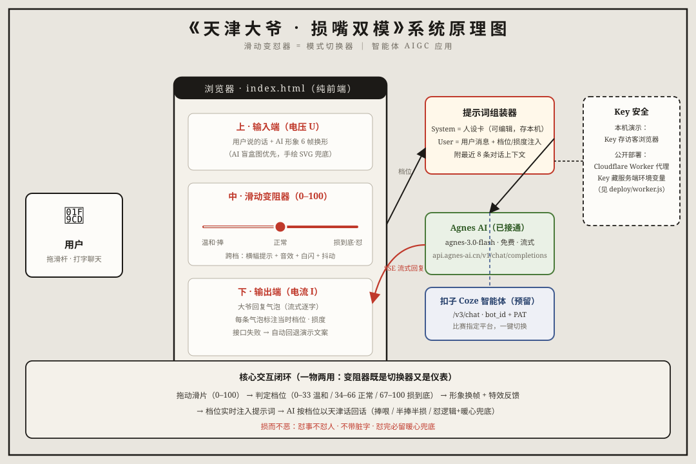

# 滑动变怼器 · 天津大爷损嘴双模智能体

> 你好好说话，天津大爷就捧你；你胡来，他就损你——但句句心善。

**第四届网络文化节 · 数智新技艺赛道 · 智能体 AIGC 应用**

一个"滑动变阻器 = 模式切换器"的 AI 对话应用：拖动滑杆，在 **温和捧哏 ↔ 损到底怼人** 之间无级调节 AI 天津大爷的力度。变阻器一物两用——既是切换器，又是仪表：滑片拖到哪，AI 形象就"进化"到哪，回答风格也随之改变。无论哪一档，永远 **损而不恶、嘴毒心善**。

## 🌐 在线体验

| 线路 | 地址 |
|---|---|
| 主站 | **https://tianjin-daye.pages.dev** |
| 备用线 | https://care-art.github.io/tianjin-daye/ |

打开即玩（内置演示文案模式）。想和**真·AI 大爷**对话：在 [agnes-ai.cn](https://agnes-ai.cn) 免费注册拿个 Key（模型 `agnes-3.0-flash` 免费开放）→ 页脚「回复源设置」→ 选 Agnes → 粘贴保存即可。Key 只存你自己的浏览器。

## ✨ 特性

- **滑动变阻器交互**：一根滑杆 0–100 驱动一切，跨档触发横幅提示 + 音效 + 白闪 + 形象抖动
- **六档形象进化**：捧哏圣手 → 嘴贫大爷 → 正常大爷 → 损嘴熟手 → 怼人大爷 → 损嘴祖师（金光环 + 三昧真火），AI 盲盒手办形象，缺图自动回退内置手绘 SVG
- **真·AI 对话**：人设 System Prompt（1200 字天津话人设卡，可在页面内编辑）+ 档位/损度实时注入 + 流式输出 + 上下文记忆；接口故障自动回退演示文案
- **输出可控性可视化**：每条气泡标注发送时的档位与损度
- **三回复源架构**：内置演示文案（零配置）/ Agnes AI / 扣子 Coze（预留通道）
- **单文件零依赖**：`index.html` 就是全部逻辑，无框架无构建，离线可跑

## 🚀 本地运行

```bash
# 方式一：直接双击 index.html（交互与形象全可用，真 AI 需要方式二）
# 方式二：起个本地服务
python -m http.server 8899
# 打开 http://127.0.0.1:8899
```

## 🏗️ 架构



核心交互闭环：拖动滑片（0–100）→ 判定档位（0–33 温和 / 34–66 正常 / 67–100 损到底）→ 形象换帧 + 特效 → 档位实时注入提示词 → AI 按档位以天津话回话。

## 📁 目录结构

```
├── index.html          # 作品本体（单文件：页面 + 逻辑 + 手绘 SVG 备用形象）
├── img/                # 六档 AI 形象图（daye-1 ~ daye-6）
├── deploy/             # Cloudflare Worker 代理（可选，供自部署藏 Key）
├── 创作说明.md          # 比赛必交材料：工具 / Prompt / 修改过程
├── 使用说明.md / .txt   # 面向收件人的完整说明书
└── 原理图.svg           # 系统原理图
```

## ⚠️ 边界设计（"损而不恶"是怎么守住的）

人设中写死了四层约束：**硬边界**（怼事不怼人、不带脏字、不碰敏感）→ **力度档位**（页面滑杆物理控制，用户无法用文字越权切换）→ **暖心兜底**（损到底档每次结尾必留一句"得嘞不怼你了，吃嘛喝嘛，心善着呢"）→ **格式约束**（禁止输出括号说明与系统字眼）。

## 📄 其他

- 比赛提交截止：2026-10-15（详见 [创作说明.md](创作说明.md)）
- 形象图为 AI 依据原创提示词生成；页面代码原创，无第三方框架与付费素材
